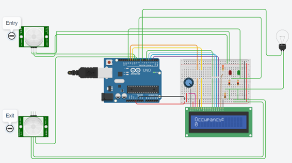
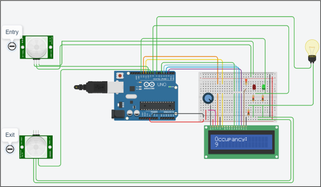

Microcontroller based Industrial Applications Project Report

AIM:
To develop a simple prototype that will mimic a real-time occupancy detection system which ultimately offers energy efficiency using TinkerCad.

RESULTS:

